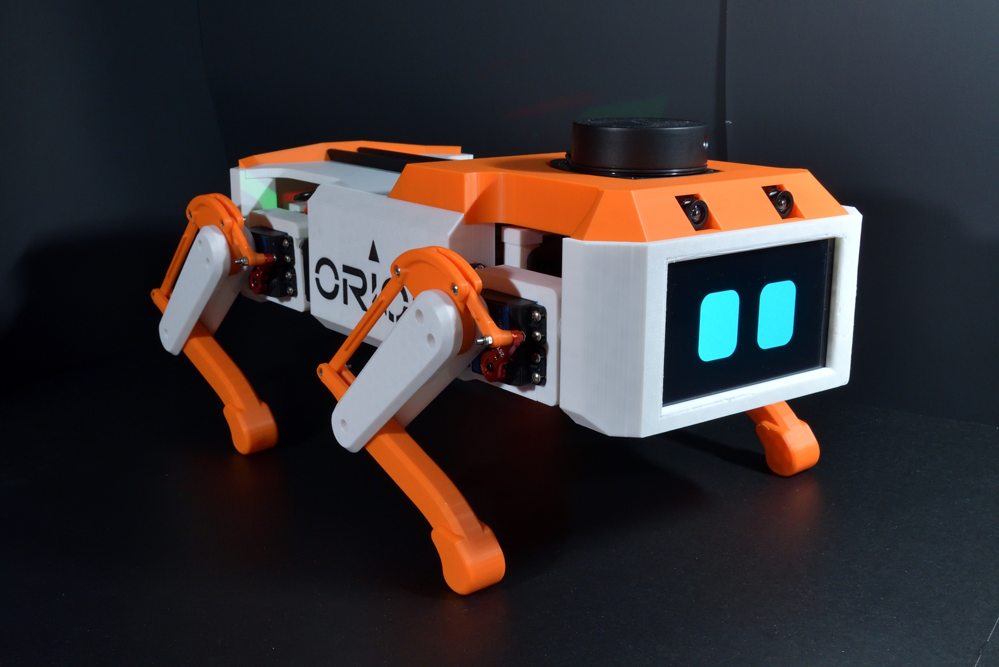
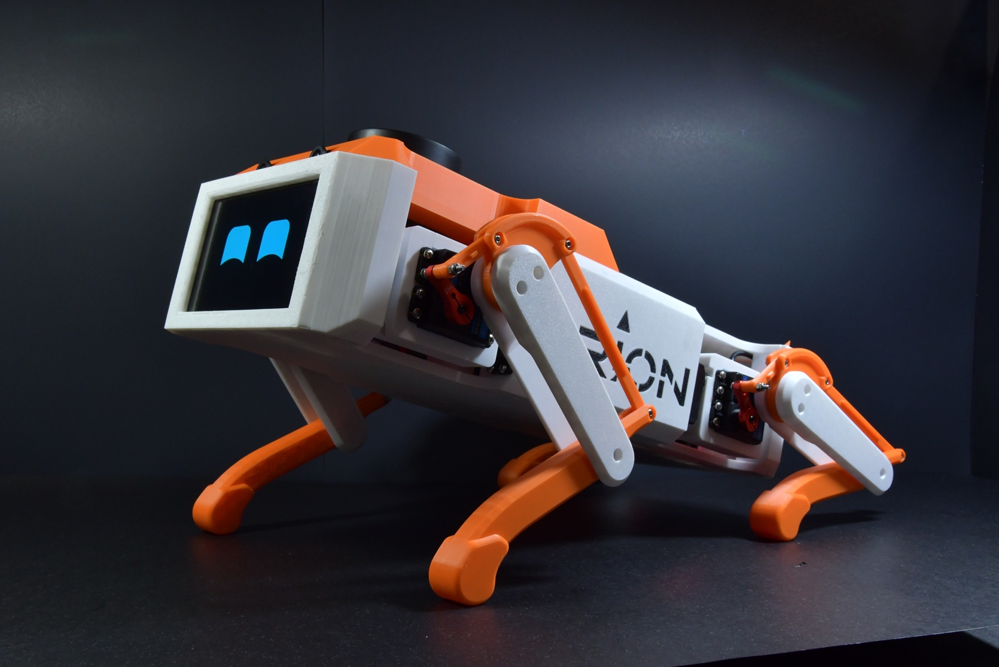
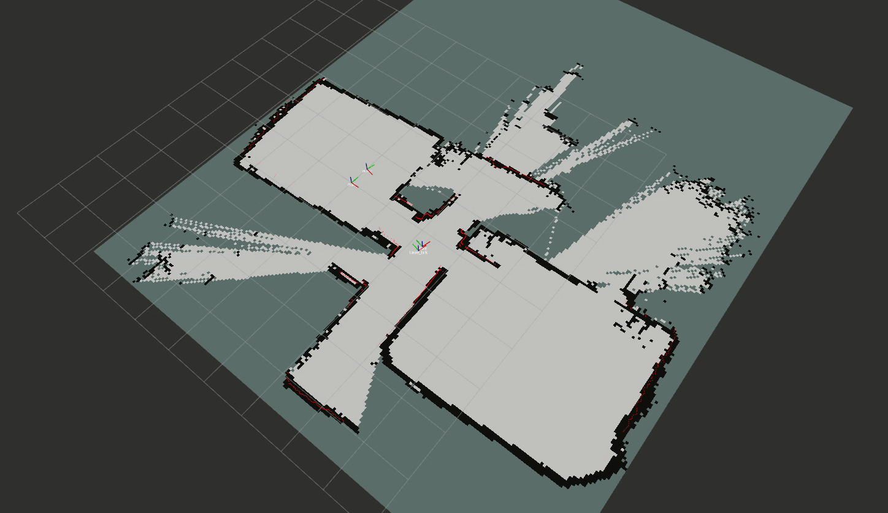
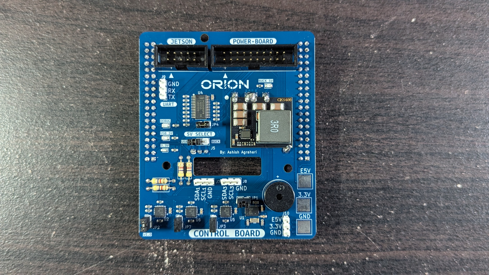
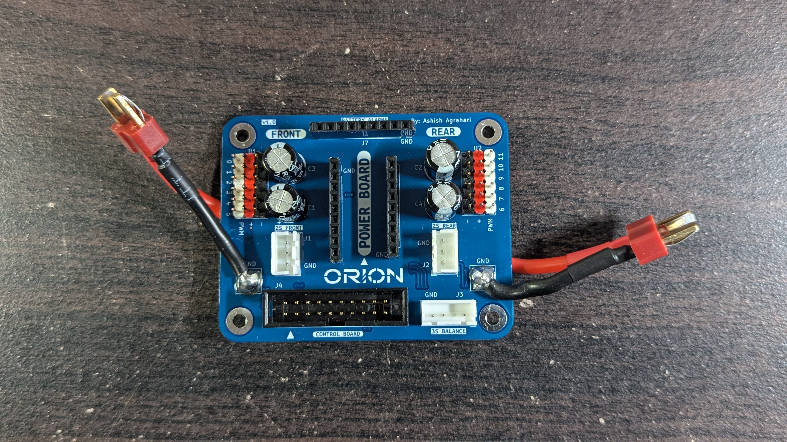

# Orion - Quadruped Robot Dog
Orion is a ROS2-driven, 12-DOF quadruped robot dog that I designed, built, and programmed from scratch.

[Demo](https://youtu.be/V8gZQcQaEmc)

## Software
Disparity Mapping

| Before  | After |
| :---: | :---: |
|   |  |

GIF?

## Electrical
The Control Board PCB was created to house all compute-related items.

The Power Board PCB was created to handle battery distribution, servo connections, and battery alarms.

### Schematics
| Control Board Schematic | Control Board Compute Schematic |
| :---: | :---: |
|  |  |
| Power Board Schematic | |
|  | |

## Mechanical

