# Orion — ROS2 Quadruped Robot

A custom-built 12-DOF quadruped robot designed, built, and programmed from scratch over 8 months. Uses an NVIDIA Jetson Orin Nano for high-level AI and perception, and a custom STM32 PCB for real-time low-level control.

Check out the [Demo Video](https://youtu.be/wUXvWBjLTyA)!

[](./photos/Orion_Thumbnail_Large.png)

[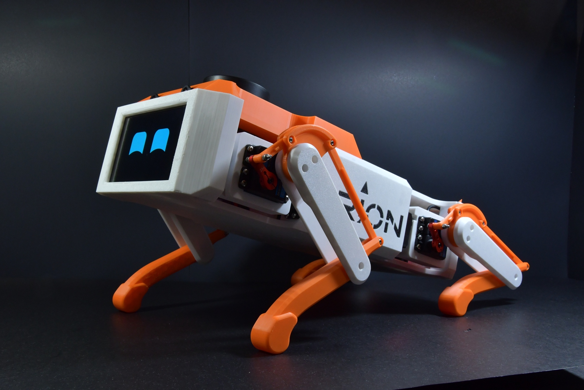](./photos/Orion_Pose_Thumb.JPG)

## Key Features

- **ROS2 / AI** — Isaac ROS Docker on Jetson Orin Nano, TensorRT for accelerated inference
- **Perception** — Stereo depth (MIDAS, SGBM) via dual CSI cameras + MediaPipe hand-pose recognition
- **SLAM & Autonomy** — RPLIDAR A1M8 with `slam_toolbox` and `nav2` for mapping and point-and-click pure-pursuit navigation
- **Embedded Control** — Custom STM32 FreeRTOS firmware: IK, walking gaits, IMU-based stabilization
- **Custom PCBs** — Multi-layer SMD boards for power distribution, servo actuation, and sensor interfacing
- **RL / Sim** — PPO training (RSL RL) in NVIDIA Isaac Lab, flat and rough terrain environments
- **Robot Eyes** — Expressive OLED eye animations via a custom Python/OpenCV node

---

## Software Architecture

**[Jetson — Isaac ROS Workspace](./Software/Jetson/workspace/isaac_ros-dev/README.md)**

| Package | Description |
|:--------|:------------|
| `orion_base` | STM32 UART bridge, joystick parser, command mux, robot eyes, joint state republisher |
| `orion_camera` | Dual CSI GStreamer node, MIDAS/SGBM depth, MediaPipe hand pose |
| `orion_lidar` | RPLIDAR A1M8 driver, `slam_toolbox` |
| `orion_navigation` | `nav2`, Pure-Pursuit path following |
| `orion_bringup` | Launch files, Docker config, systemd auto-start |
| `orion_msgs` | Custom messages: motion cmd, eye cmd, battery voltage, IMU, leg info |
| `orion_urdf` | URDF model with SolidWorks meshes, RViz launch |

**[STM32](./Software/STM32Firmware/README.md) · [Orion Firmware](./Software/STM32Firmware/Orion/README.md)**

- 5 FreeRTOS tasks: Real-time IK & gait control (Realtime) with 3-DOF per leg and 6-DOF body posture control, UART RX/TX with Jetson via DMA (High/Normal), IMU reading, Battery monitoring.

**[Reinforcement Learning](./Software/reinforcement-learning/README.md)**

- PPO training in Isaac Lab with flat and rough terrain environments. 
- SolidWorks → URDF → USD pipeline.

---

### Software Gallery

| LiDAR SLAM | Autonomous Navigation |
| :---: | :---: |
| 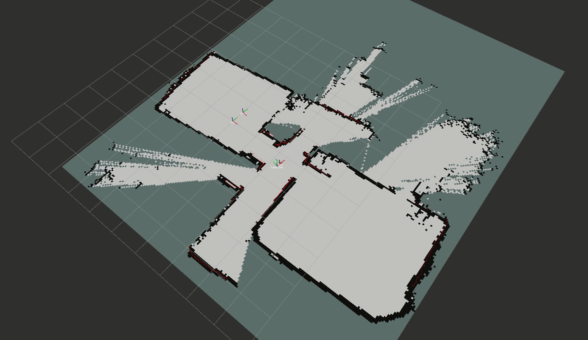 | 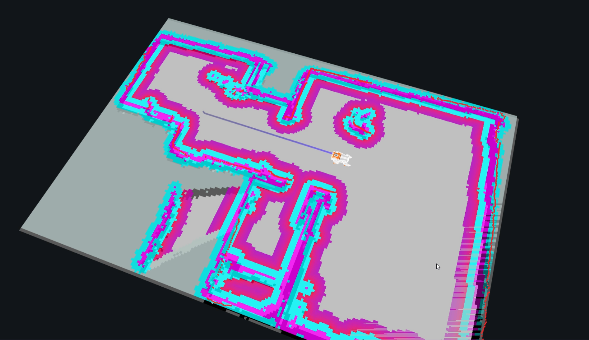 |
| Original Camera Feed | TensorRT Depth Map |
| 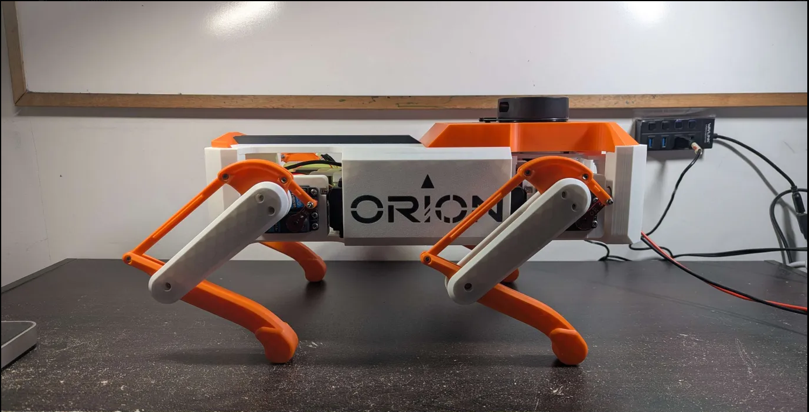 | 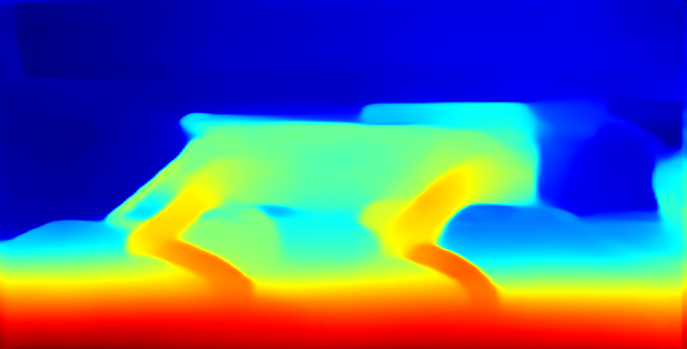 |
| Hand Pose Detection | Reinforcement Learning in Isaac Lab |
| 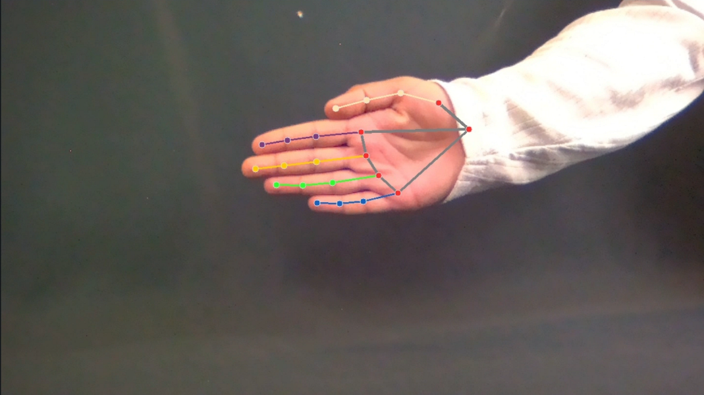 | 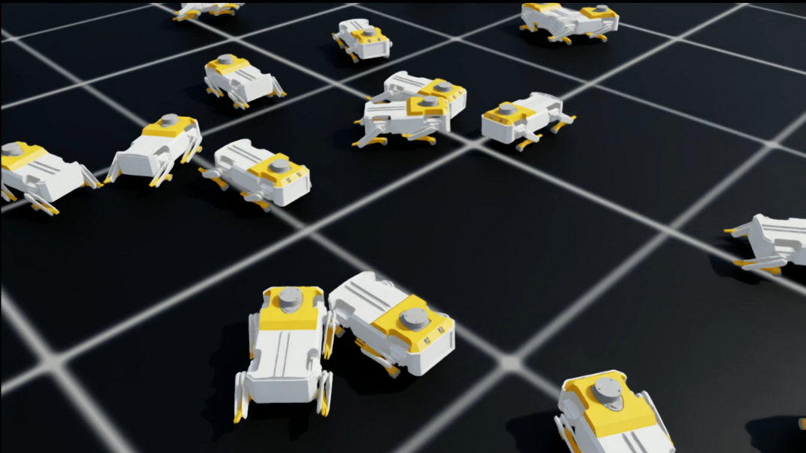 |

<p align="center">
    <strong>Foxglove Dashboard</strong>
</p>

[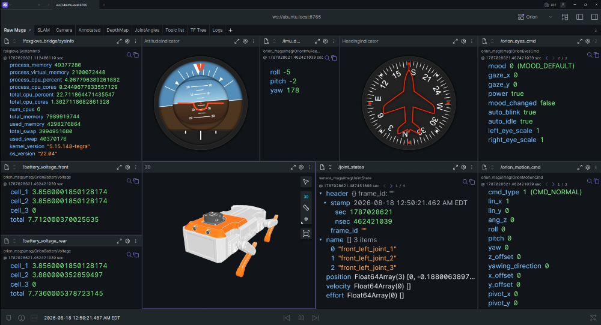](./photos/Foxglove.png)

---

## Electrical & Electronics

Custom multi-layer KiCad PCBs, fully SMD-assembled. Multiple I2C buses with LTC4311 active termination, extensive test pads and debug headers.

- **Control Board** — STM32F401, BNO055 IMU, PCA9685 servo driver
- **Power Board** — Battery distribution, INA3221 voltage monitoring (3 rails), high-current servo lines, battery alarm

### Electrical Gallery
| Control Board | Power Board |
| :---: | :---: |
| 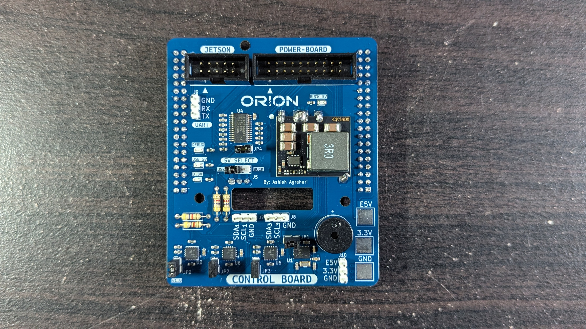 | 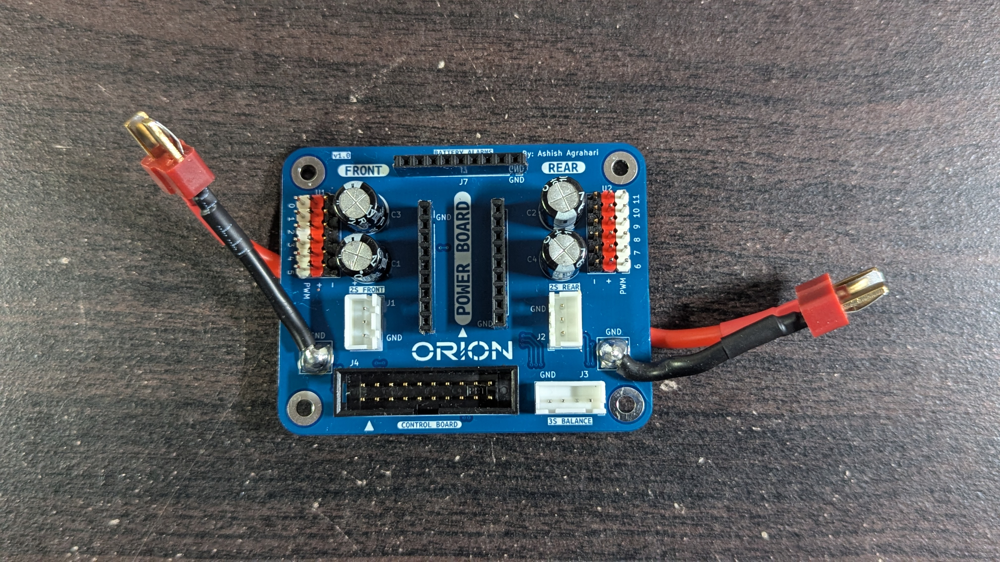 |

| Control Board | Control Board Compute | Power Board |
| :---: | :---: | :---: |
| 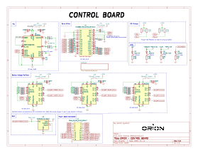 | 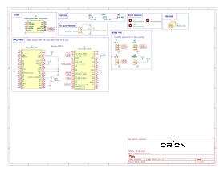 | 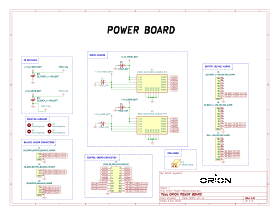 |

---

## Mechanical Design

Chassis iteratively modelled in SolidWorks. 3D printed with 2-part silicone injection-molded feet. Bearings in all 12 joints. Magnetic mounts for tool-free access to internal electronics. Single-leg linear-rail test jig used to validate IK and gait before full integration.

| Main body parts | Leg Assembly & Silicone Feet |
| :---: | :---: |
| 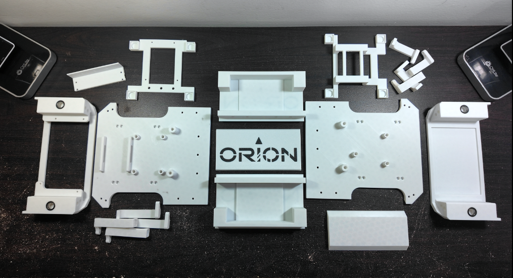 | 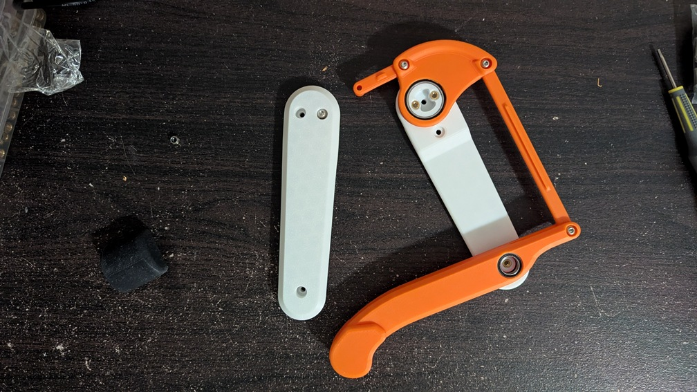 |
| Inside Orion (Jetson + PCBs + Display only) | Inside Orion (including Batteries + Lidar + Cameras) |
| 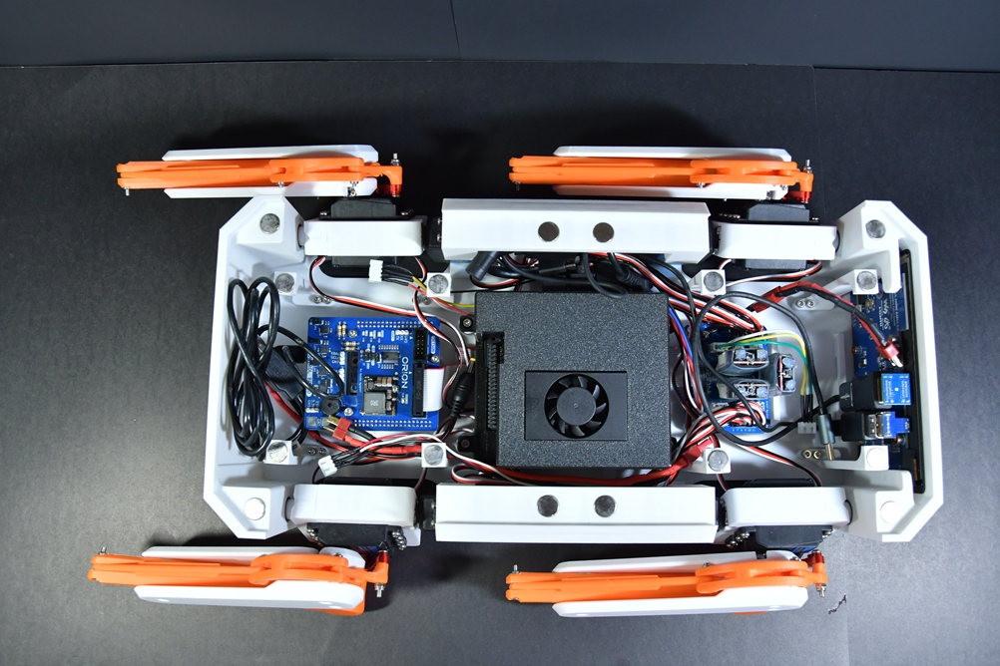 | 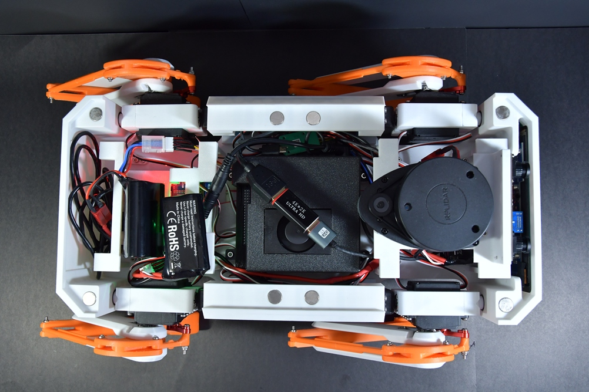 |

---

## Repository Structure
Important directories:
```
Quadruped/
├── Software/
│   ├── Jetson/workspace/isaac_ros-dev/   # Isaac ROS Docker workspace (ROS2 packages)
│   ├── STM32Firmware/
│   │   ├── Orion/                        # Main FreeRTOS firmware (CMake + STM32CubeIDE)
│   │   └── Orion-Controls/               # Legacy PlatformIO firmware
│   ├── reinforcement-learning/           # Isaac Lab PPO training
│   ├── TestScripts/                      # Servo calibration, camera, depth mapping tests
├── models/                               # SolidWorks parts & assemblies, STL, 3MF exports → README
├── urdf/                                 # URDF iterations (ROS2, RL variants) → README
├── pcb/                                  # KiCad projects (Control Board, Power Board) → README
```
